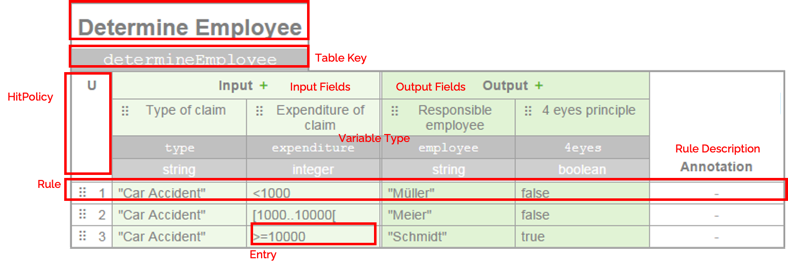

# Decision Table 

This library enables the creation and conversion of decision tables in Golang programming language. Inspired by the JBOSS Drools or Camunda DMN Suite. 
Decions table are commonly used or rather visualized as a table in a UI to represent complex decisions in a more human-readable way. The library can be used as a data representation in Golang for such frontend/UI components. 

Each table represents a complex system of rules. Such systems describe a decision for which input, which output is to be generated. 
The library allows:
* The creation of such rules
* Data-type dependent validation of rule expression
* Converting into a rule-engine format (to finally execute rules)


# Table Example


# Decision Table Builder (Code Example)
```
table, _ := decisionTable.CreateDecisionTable().
		SetName("Determine Employee").
		SetDefinitionKey("determineEmployee").
		SetNotationStandard(data.GRULE).
		SetHitPolicy(data.Unique).
		AddInputField(data.TestField{Name: "Claim", Key: "TypeOfClaim", Typ: data.String}).
		AddInputField(data.TestField{Name: "Claim", Key: "ExpenditureOfClaim", Typ: data.Integer}).
		AddOutputField(data.TestField{Name: "Employee", Key: "ResponsibleEmployee", Typ: data.String}).
		AddOutputField(data.TestField{Name: "Employee", Key: "FourEyesPrinciple", Typ: data.Boolean}).
		AddRule("R1").
		AddInputEntry(`"Car Accident"`, data.SFEEL).
		AddInputEntry("<1000", data.SFEEL).
		AddOutputEntry(`"Müller"`, data.SFEEL).
		AddOutputEntry("false", data.SFEEL).
		BuildRule().
		AddRule("R2").
		AddInputEntry(`"Car Accident"`, data.SFEEL).
		AddInputEntry("[1000..10000]", data.SFEEL).
		AddOutputEntry(`"Schulz"`, data.SFEEL).
		AddOutputEntry("false", data.SFEEL).
		BuildRule().
		AddRule("R3").
		AddInputEntry("-", data.SFEEL).
		AddInputEntry(">=10000", data.SFEEL).
		AddOutputEntry("-", data.SFEEL).
		AddOutputEntry("true", data.SFEEL).
		BuildRule().
		Build()
```

We assume that the frontend will represent a decision table as a kind of table. In case, that a user changes something in the frontend table, we assume that the old decision table representation will be dropped and then rebuild from the new 
(frontend) table (which was manipulated by the user). By doing so, we don't need any "insert function" for rules/inputs/outputs etc and so it keeps the DecisionTable-Builder simple. 

## Hit Policies and Collect Operators
A decision table consists of several rules, typically represented as rows. When reading such a row we look at certain input values and deduct a certain result represented by output values. 

When using the simplest hit policy "unique" (U), such rules do not overlap: only a single rule must match. 

Now consider that we build a decision table with overlapping rules. In other words that means more than one rule may match a given set of input values. We then need one of the alternative hit policy indicators to unambiguously understand the decision logic according to which such rules are interpreted.

### Single Decision Tables 
Such tables either return the output of only one rule or aggregate the output of many rules into one result. The hit policies to be considered are
* **Unique:** Rules do not overlap. Only a single rule can match.
* **First:** Rules are evaluated from top to bottom. Rules may overlap, but only the first match counts.
* **Priority:** Rule outputs are prioritized. Rules may overlap, but only the match with the highest output priority counts.
* **Any:** Multiple matching rules must not make a difference: all matching rules must lead to the same output.
* **Collect:** The output of all matching rules is aggregated by means of an operator:
    * **Sum:** Sums/Add all outputs of the matching rule’s distinct outputs.
    * **Minimum:** Take the smallest value of all the matching rule’s outputs.
    * **Maximum:** Take the largest value of all the matching rule’s outputs.
    * **Number:** Return the number of all the matching rule’s distinct outputs. 

### Multiple Result DecisionTable
Multiple result tables may return the output of multiple rules. The hit policies for such tables are:

* **Collect:** All outputs of the matching rules are combined in an arbitrarily ordered list of all the output entries.
  * **List:** Collect all outputs of all matching rules in a list of output entries
* **Rule Order:** All outputs of the matching rules are combined in a list of outputs ordered by the sequence of those rules in the decision table.
* **Output Order:** All outputs of the matching rules are combined in a list of outputs ordered by their (decreasing) output priority.

### Examples
Examples can be found here: [Camunda Page](https://camunda.com/best-practices/choosing-the-dmn-hit-policy/#_knowing_the_dmn_hit_policy_strong_basics_strong)

## Supported Variable Types
The allowed types of input or output variables differs on the selected notation standard of a decision table:

Variable Types | DMN Notation | GRL Notation
------------ | ---------------|--------------
Boolean|X|X
String|X|X
Integer|X|X
Float||X   
Long|X|    
Double|X|  
DateTime|X|X    

More Details can be found here:
* [GRULE](http://hyperjumptech.viewdocs.io/grule-rule-engine/GRL_en/)
* [Decision Model and Notation DMN (OMG)](https://www.omg.org/spec/DMN/1.2/PDF)

## Supported Entry Languages
The expresion language defined the functions and comparisons of a single rule entry. It depends on the chosen table notations standard.
So far we support the SFEEL Standard partially. 
### SFEEL INPUT EXPRESSIONS
* [Simple Friendly Enough Entry Language (SFEEL)](https://docs.camunda.org/manual/7.4/reference/dmn11/feel/language-elements/)

# Converter for Standards/Engines
The following converter are supported, so far:
## ["Gopher Holds The Rules (GRULE)"](http://hyperjumptech.viewdocs.io/grule-rule-engine/GRL_en/)
```
// Convert Table Into Grule Rules
converter, _ := conv.CreateTableConverterFactory().GetTableConverter(model.GRULE, model.GRL)
rules, err := table.Convert(converter)
```
